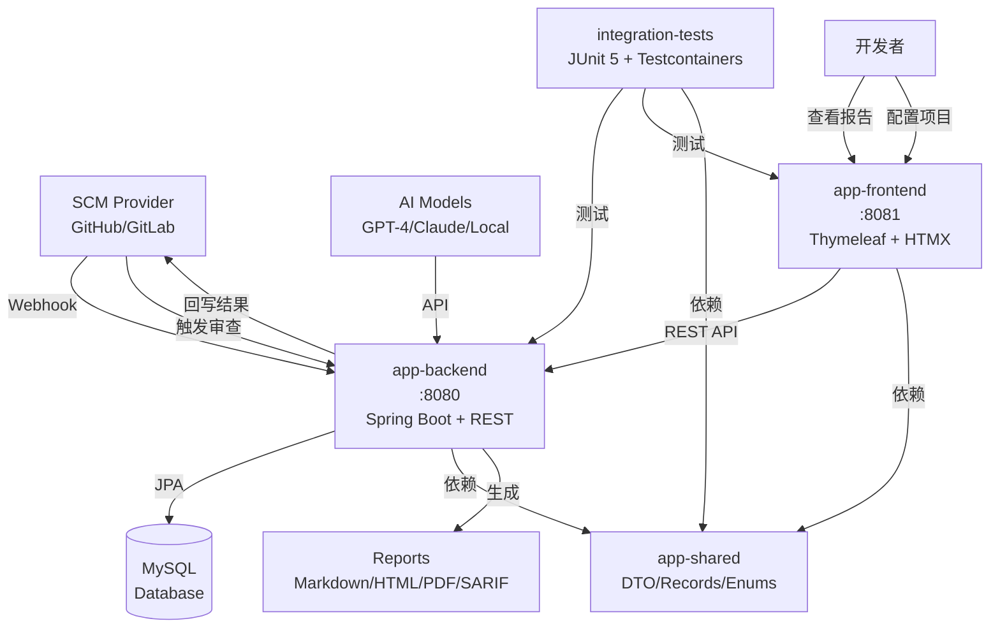

# AI Code Reviewer

AI驱动的代码审查系统，支持多Git平台（GitHub、GitLab）和多AI模型的智能代码审查。

## 🏗️ 系统架构

### 整体架构设计
- **前后端分离**: 前端 Java (Spring Boot + Thymeleaf)，后端 Java (Spring Boot + REST API)
- **无消息队列**: 采用同步处理模式，简化部署和运维
- **单数据库**: 使用 MySQL 作为唯一数据存储，支持事务和数据一致性
- **模块化设计**: 多 Maven 模块，清晰的依赖关系和职责分离



### 技术架构特点
- ✅ **同步处理**: 无消息队列，请求-响应模式，易于调试和监控
- ✅ **单数据库**: MySQL 统一存储，ACID 事务保证数据一致性
- ✅ **纯 Java 栈**: 前后端均使用 Java + Spring Boot，技术栈统一
- ✅ **容器化支持**: 支持 Docker 部署，便于扩展和运维
- ✅ **模块化**: 清晰的模块边界，便于团队协作和维护

## 📦 模块结构

```
ai-reviewer/
├── app-shared/          # 共享模型（DTO、Record、Enum）
├── app-backend/         # 后端服务（REST API、审查编排、评分引擎）
├── app-frontend/        # 前端应用（仪表盘、报告预览）
├── integration-tests/   # 集成测试（Testcontainers + JUnit 5）
└── pom.xml             # 父级POM配置
```

### 模块说明

- **app-shared**: 纯Java记录类和枚举，不依赖其他模块
- **app-backend**: Spring Boot REST服务，端口8080，处理代码审查逻辑
- **app-frontend**: 独立的Spring Boot Web应用，端口8081，提供用户界面
- **integration-tests**: 跨模块集成测试，使用MySQL Testcontainer

## 🚀 快速启动

### 前提条件

- **JDK 17+** (推荐使用JDK 17)
- **Maven 3.8+**
- **MySQL 8.0+** (生产环境) 或 **Docker** (开发/测试)
- **Git**

### 1. 克隆项目

```bash
git clone <your-repo-url>
cd ai-reviewer
```

### 2. 环境配置

#### 环境变量清单

复制并配置环境变量模板：
```bash
# 复制环境变量模板
cp scripts/dev.env.example scripts/dev.env
# 编辑并填入实际值
vi scripts/dev.env
```

**核心环境变量**：
```bash
# 数据库配置 (必需)
export DB_URL=jdbc:mysql://localhost:3306/ai_reviewer
export DB_USER=root
export DB_PASS=your_database_password

# GitHub 集成 (可选)
export GITHUB_API_BASE=https://api.github.com
export GITHUB_CLIENT_ID=your_github_client_id
export GITHUB_CLIENT_SECRET=your_github_client_secret
export GITHUB_WEBHOOK_SECRET=your_github_webhook_secret
export GITHUB_ACCESS_TOKEN=your_github_access_token

# GitLab 集成 (可选)
export GITLAB_API_BASE=https://gitlab.com/api/v4
export GITLAB_CLIENT_ID=your_gitlab_client_id
export GITLAB_CLIENT_SECRET=your_gitlab_client_secret
export GITLAB_WEBHOOK_SECRET=your_gitlab_webhook_secret
export GITLAB_ACCESS_TOKEN=your_gitlab_access_token

# AI 模型配置 (至少配置一个)
export OPENAI_API_KEY=your_openai_api_key
export ANTHROPIC_API_KEY=your_anthropic_api_key

# 应用配置
export BACKEND_PORT=8080
export FRONTEND_PORT=8081
export REPORTS_OUTPUT_DIR=./reports
```

详细的环境变量说明请参考 `scripts/dev.env.example`。

### 3. 数据库设置

#### 选项A：使用本地MySQL
```bash
# 创建数据库
mysql -u root -p
CREATE DATABASE ai_reviewer CHARACTER SET utf8mb4 COLLATE utf8mb4_unicode_ci;
```

#### 选项B：使用Docker
```bash
docker run -d --name ai-reviewer-mysql \
  -e MYSQL_DATABASE=ai_reviewer \
  -e MYSQL_ROOT_PASSWORD=password \
  -p 3306:3306 \
  mysql:8.0
```

### 4. 构建和启动

#### 一键构建验证
```bash
# 构建、测试、打包所有模块
mvn -B -ntp clean verify

# 仅构建，跳过测试 (快速启动)
mvn -B -ntp clean package -DskipTests
```

#### 启动服务

**启动后端服务** (端口8080):
```bash
java -jar app-backend/target/*.jar

# 或者使用 Maven
cd app-backend && mvn spring-boot:run
```

**启动前端服务** (端口8081):
```bash
java -jar app-frontend/target/*.jar

# 或者使用 Maven  
cd app-frontend && mvn spring-boot:run
```

#### 快速启动脚本
```bash
# 创建启动脚本
cat > scripts/start-dev.sh << 'EOF'
#!/bin/bash
# 加载环境变量
source scripts/dev.env

# 启动后端 (后台运行)
nohup java -jar app-backend/target/*.jar > logs/backend.log 2>&1 &
echo "后端服务启动中... PID: $!"

# 等待后端启动
sleep 10

# 启动前端 (后台运行)
nohup java -jar app-frontend/target/*.jar > logs/frontend.log 2>&1 &
echo "前端服务启动中... PID: $!"

echo "服务启动完成！"
echo "后端: http://localhost:${BACKEND_PORT:-8080}"
echo "前端: http://localhost:${FRONTEND_PORT:-8081}"
EOF

chmod +x scripts/start-dev.sh
./scripts/start-dev.sh
```

### 5. 验证启动

- 后端健康检查: http://localhost:8080/api/health
- 前端应用: http://localhost:8081
- 后端API文档: http://localhost:8080/api/swagger-ui.html (如果配置了Swagger)

## ⚠️ 重要注意事项

### 文件名限制
- **禁止非 ASCII 文件名**: 系统仅处理 ASCII 字符文件名，包含中文、特殊符号的文件将被跳过
- **建议命名规范**: 使用英文字母、数字、下划线和短横线组合

### 数据安全
- **默认脱敏处理**: 发送给 AI 模型的 Diff 内容默认经过脱敏处理
  - 自动移除敏感信息：密码、API 密钥、数据库连接字符串等
  - 保留代码结构和逻辑，确保分析准确性
- **配置敏感词**: 可在配置文件中自定义敏感信息模式

### 性能建议
- **大文件处理**: 单个 Diff 超过 10MB 将被分片处理
- **并发限制**: 默认最大 5 个并发 AI 请求，避免触发 API 限流
- **超时设置**: AI 请求超时时间 30 秒，避免长时间等待

### 开发环境
- **Mock 模式**: 开发环境可启用 Mock 模式，无需配置真实 AI API
- **本地测试**: 使用 Testcontainers 进行集成测试，无需手动配置数据库

## 🛠️ 开发指南

### Maven命令

```bash
# 格式化代码（Spotless）
mvn spotless:apply

# 检查依赖版本
mvn versions:display-dependency-updates

# 数据库迁移  
mvn flyway:migrate -pl app-backend

# 清理数据库
mvn flyway:clean -pl app-backend

# 生成可执行JAR
mvn clean package -DskipTests
```

### 配置文件

- **后端配置**: `app-backend/src/main/resources/application.yml`  
- **前端配置**: `app-frontend/src/main/resources/application.yml`
- **测试配置**: `integration-tests/src/test/resources/application-integration-test.yml`

### 数据库迁移

Flyway迁移脚本位于：`app-backend/src/main/resources/db/migration/`

命名格式：`V{版本}__{描述}.sql`，例如：
- `V1__Create_review_run_table.sql`
- `V2__Add_finding_table.sql`

## 🔧 技术栈

| 组件 | 技术选型 | 版本 |
|------|---------|------|
| **JDK** | OpenJDK | 17+ |
| **构建工具** | Maven | 3.8+ |
| **框架** | Spring Boot | 3.3.x |
| **数据库** | MySQL | 8.0+ |
| **ORM** | Spring Data JPA/Hibernate | - |
| **前端** | Thymeleaf + HTMX | - |
| **测试** | JUnit 5 + Testcontainers | - |
| **文档处理** | Flexmark + Flying Saucer | - |
| **容器化** | Docker (可选) | - |

## 📊 核心功能

### 代码审查流程
1. **Webhook触发**: GitHub/GitLab发送Pull Request事件
2. **差异获取**: 获取代码变更差异（diff）
3. **AI分析**: 多模型并行分析代码质量
4. **评分计算**: 5维度评分（安全、质量、可维护性、性能、测试覆盖率）
5. **报告生成**: 生成Markdown/HTML/PDF/SARIF格式报告
6. **结果回写**: 更新PR状态和评论

### 评分维度
- **SECURITY** (30%): 安全漏洞和风险
- **QUALITY** (25%): 代码质量和最佳实践
- **MAINTAINABILITY** (20%): 可维护性和可读性
- **PERFORMANCE** (15%): 性能影响和优化
- **TEST_COVERAGE** (10%): 测试覆盖率和测试质量

## 🚧 开发状态

- ✅ Maven多模块工程架构
- ✅ Spring Boot基础框架  
- ✅ 数据模型设计
- 🔄 SCM适配器实现
- 🔄 AI模型集成
- 🔄 评分引擎开发
- 🔄 报告生成器
- 🔄 前端界面开发

## 📝 许可证

[MIT License](LICENSE)

## 🤝 贡献指南

1. Fork 此项目
2. 创建特性分支 (`git checkout -b feature/amazing-feature`)
3. 提交改动 (`git commit -m 'Add some amazing feature'`)
4. 推送分支 (`git push origin feature/amazing-feature`)
5. 创建 Pull Request

## 🔧 环境变量加载

### 方式一：使用环境变量文件
```bash
# 复制模板文件
cp scripts/dev.env.example scripts/dev.env

# 编辑环境变量
vi scripts/dev.env

# 加载环境变量
source scripts/dev.env

# 启动应用
java -jar app-backend/target/*.jar
```

### 方式二：使用 application.yml 覆盖
```yaml
# app-backend/src/main/resources/application-local.yml
spring:
  datasource:
    url: ${DB_URL:jdbc:mysql://localhost:3306/ai_reviewer}
    username: ${DB_USER:root}
    password: ${DB_PASS:password}

ai-reviewer:
  github:
    api-base: ${GITHUB_API_BASE:https://api.github.com}
    client-id: ${GITHUB_CLIENT_ID:}
  gitlab:
    api-base: ${GITLAB_API_BASE:https://gitlab.com/api/v4}
    client-id: ${GITLAB_CLIENT_ID:}
```

### 方式三：Docker Compose
```yaml
# docker-compose.yml
version: '3.8'
services:
  ai-reviewer-backend:
    image: ai-reviewer-backend:latest
    environment:
      - DB_URL=jdbc:mysql://mysql:3306/ai_reviewer
      - DB_USER=root
      - DB_PASS=password
      - GITHUB_API_BASE=https://api.github.com
    depends_on:
      - mysql
  
  mysql:
    image: mysql:8.0
    environment:
      MYSQL_DATABASE: ai_reviewer
      MYSQL_ROOT_PASSWORD: password
```

## 📞 联系方式

- 项目地址: https://github.com/your-org/ai-reviewer
- 问题反馈: https://github.com/your-org/ai-reviewer/issues
- 邮箱: support@ai-reviewer.com